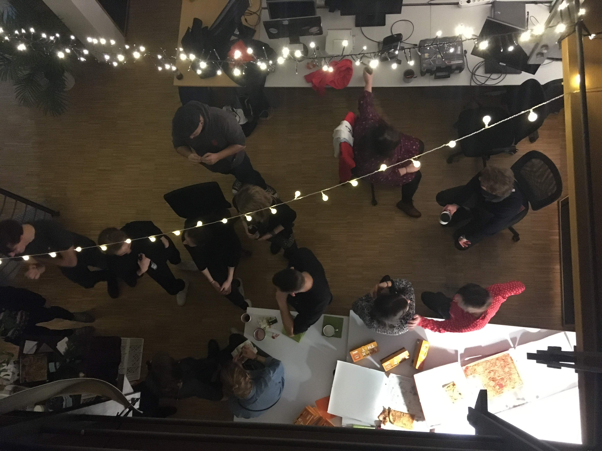

# Learning GitHub and Markdown

First time using GitHub and learning to use Markdown, whoo.

## This is a subtitle

### ordered list
1. First item
2. Second item
3. Third item

### unordered list
- First item
- Second item
- Third item

## Link a page
[Markdown Guide](https://www.markdownguide.org/)
[ZType Typing Game](https://zty.pe/)

## Adding an image

## Adding my own image

